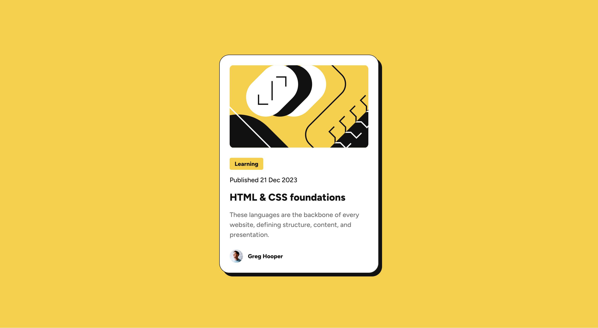

# Frontend Mentor - Blog preview card solution

This is a solution to the [Blog preview card challenge on Frontend Mentor](https://www.frontendmentor.io/challenges/blog-preview-card-ckPaj01IcS). Frontend Mentor challenges help you improve your coding skills by building realistic projects.

## Table of contents

-   [Overview](#overview)
    -   [The challenge](#the-challenge)
    -   [Screenshot](#screenshot)
    -   [Links](#links)
-   [My process](#my-process)
    -   [Built with](#built-with)
    -   [What I learned](#what-i-learned)
    -   [Useful resources](#useful-resources)
-   [Author](#author)
-   [Acknowledgments](#acknowledgments)

## Overview

### The challenge

Users should be able to:

-   See hover and focus states for all interactive elements on the page

### Screenshot



### Links

-   Solution URL: [https://github.com/dpencsi/frontendmentor_blog_preview_card](https://github.com/dpencsi/frontendmentor_blog_preview_card)
-   Live Site URL: [https://dpencsi.github.io/frontendmentor_blog_preview_card/](https://dpencsi.github.io/frontendmentor_blog_preview_card/)

## My process

### Built with

-   Semantic HTML5 markup
-   CSS custom properties
-   Flexbox

### What I learned

In this challenge the frontendmentor wanted responsive fonts withouth media query. In this case clamp is a good solution.

The function takes three parameters: a minimum value, a preferred value, and a maximum allowed value.
I used a webiste tool what you can see at the [Useful resources](#useful-resources) part and if you would like to know how the website calcualte there is a nice description about it here [Linearly Scale font-size with CSS clamp() Based on the Viewport ](https://css-tricks.com/linearly-scale-font-size-with-css-clamp-based-on-the-viewport/)

```css
:root {
    /* Desktop Fonts */
    --text-preset-1-lg: 1.5rem; /* 24px */

    /* Mobile Fonts */
    --text-preset-1-sm: 1.25rem; /* 20px */
    
    --text-preset-1: clamp(var(--text-preset-1-sm), -0.3947rem + 7.0175vw, var(--text-preset-1-lg));
}
```

### Useful resources

-   [utopia.fyi](https://utopia.fyi/clamp/calculator?a=360%2C1240) - This helped me for create responsive fonts withouth media query using clamp. I really like it and will use it going forward.

## Acknowledgments

First I solved this challange with my way and the font with media query of course then searched for solutions and other people solution.

I like to be open for more solution and collect all the good stuff and info. Learning from better people is always a good method and I have found a youtuber [Dave Cross](https://www.youtube.com/@dave-cross/videos) who is like a little hidden treasure.

I like how he tells you about his solution and tells those little things, tricks and good practices I have never heard or used before. Well there are some pro level stuff what he use and even me need to read about those things and understand but I still recommend to follow him.

Oh and there is another good thing to keep in mind and that is you don't need to copy everthing! My solution is different than him but I used the important part. A website structure can be different by the coder thinking way. Its nice to copy but build that knowledge up. Try to undertand first and not just copy everything withouth understanding. So what I didn't know about yet like CUBE CSS and some pro level selectors even me didn't put in my code. Later yes when I research about it and understand it.